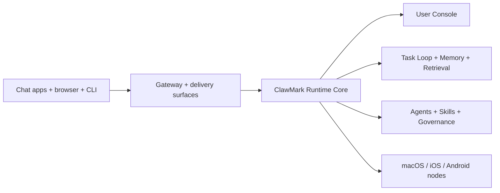

# ClawMark 🐾

<p align="center">
    
    
</p>

<p align="center">
  <strong>A sovereign local AI runtime with a browser User Console, managed task loop, and multi-channel delivery.</strong><br />
  Run one local system for chat, tasks, memory, routing, and messaging surfaces across WhatsApp, Telegram, Discord, iMessage, and more.
</p>

<Columns>
  <Card title="Get Started" href="/start/getting-started" icon="rocket">
    Install ClawMark and bring up the local runtime in minutes.
  </Card>
  <Card title="Run the Wizard" href="/start/wizard" icon="sparkles">
    Guided setup with `openclaw onboard` and pairing flows.
  </Card>
  <Card title="Open the User Console" href="/web/dashboard" icon="layout-dashboard">
    Launch the browser dashboard for chat, runtime controls, and surfaces.
  </Card>
</Columns>

## What is ClawMark?

ClawMark is a **self-hosted local AI runtime**. It combines a browser User Console, managed task loop, memory and retrieval layers, governed agents and skills, and multi-channel delivery surfaces in one local system. You run it on your own machine or server and keep formal task state, user preferences, and runtime governance under local control.

You can think of the Gateway as the delivery and transport layer around the runtime, while ClawMark is the product that owns the local operating surface, task loop, and system behavior.

**Who is it for?** Developers and power users who want a personal or team-local AI operating surface they can message from anywhere, without giving up control of data, routing, or execution policy.

**What makes it different?**

- **Sovereign local runtime**: formal task state, memory, and operator policy stay on your hardware
- **User Console first**: browser dashboard for chat, runtime controls, tasks, sessions, and config
- **Multi-surface delivery**: one local runtime can serve WhatsApp, Telegram, Discord, iMessage, the browser dashboard, and more
- **Agent-native**: built for coding agents with tool use, sessions, memory, and governed multi-agent routing
- **Open source**: MIT licensed, community-driven

**What do you need?** Node 24 (recommended), or Node 22 LTS (`22.16+`) for compatibility, an API key from your chosen provider, and about 5 minutes.

## How it works



The runtime is the local source of truth for task state, memory, preferences, and governance. The Gateway exposes those capabilities to browser, channel, and node surfaces.

## Key capabilities

<Columns>
  <Card title="Sovereign runtime" icon="shield">
    Keep local control over tasks, routing, user preferences, and formal runtime state.
  </Card>
  <Card title="User Console" icon="monitor">
    Browser dashboard for chat, runtime controls, tasks, sessions, and configuration.
  </Card>
  <Card title="Task loop + memory" icon="workflow">
    Managed runs, reviews, retries, distillation, and retrieval inside one local runtime.
  </Card>
  <Card title="Multi-channel delivery" icon="network">
    WhatsApp, Telegram, Discord, iMessage, and plugin channels from one local system.
  </Card>
  <Card title="Governed agent ecology" icon="route">
    Multi-agent routing, worker policy, and capability governance without losing runtime control.
  </Card>
  <Card title="Mobile nodes" icon="smartphone">
    Pair iOS and Android nodes for Canvas, camera, and voice-enabled workflows.
  </Card>
</Columns>

## Quick start

<Steps>
  <Step title="Install ClawMark">
    ```bash
    npm install -g openclaw@latest
    ```
  </Step>
  <Step title="Onboard and install the service">
    ```bash
    openclaw onboard --install-daemon
    ```
  </Step>
  <Step title="Pair WhatsApp and start the Gateway">
    ```bash
    openclaw channels login
    openclaw gateway --port 18789
    ```
  </Step>
</Steps>

<Note>
Compatibility note: the package name, CLI entrypoint, and config path still use `openclaw` during the migration, even though the product surface is ClawMark.
</Note>

Need the full install and dev setup? See [Quick start](/start/quickstart).

## User Console

Open the browser User Console after the Gateway starts.

- Local default: [http://127.0.0.1:18789/](http://127.0.0.1:18789/)
- Remote access: [Web surfaces](/web) and [Tailscale](/gateway/tailscale)

<p align="center">
  
</p>

## Configuration (optional)

Config still lives at `~/.openclaw/openclaw.json` during the migration.

- If you **do nothing**, ClawMark uses the bundled Pi binary in RPC mode with per-sender sessions.
- If you want to lock it down, start with `channels.whatsapp.allowFrom` and (for groups) mention rules.

Example:

```json5
{
  channels: {
    whatsapp: {
      allowFrom: ["+15555550123"],
      groups: { "*": { requireMention: true } },
    },
  },
  messages: { groupChat: { mentionPatterns: ["@openclaw"] } },
}
```

## Start here

<Columns>
  <Card title="Docs hubs" href="/start/hubs" icon="book-open">
    All docs and guides, organized by use case.
  </Card>
  <Card title="Configuration" href="/gateway/configuration" icon="settings">
    Gateway settings, tokens, provider config, and compatibility paths.
  </Card>
  <Card title="Remote access" href="/gateway/remote" icon="globe">
    SSH and tailnet access patterns.
  </Card>
  <Card title="Channels" href="/channels/telegram" icon="message-square">
    Channel-specific setup for WhatsApp, Telegram, Discord, and more.
  </Card>
  <Card title="Nodes" href="/nodes" icon="smartphone">
    iOS and Android nodes with pairing, Canvas, camera, and device actions.
  </Card>
  <Card title="Help" href="/help" icon="life-buoy">
    Common fixes and troubleshooting entry point.
  </Card>
</Columns>

## Learn more

<Columns>
  <Card title="Full feature list" href="/concepts/features" icon="list">
    Complete channel, routing, and media capabilities.
  </Card>
  <Card title="Multi-agent routing" href="/concepts/multi-agent" icon="route">
    Workspace isolation and per-agent sessions.
  </Card>
  <Card title="Security" href="/gateway/security" icon="shield">
    Tokens, allowlists, and safety controls.
  </Card>
  <Card title="Troubleshooting" href="/gateway/troubleshooting" icon="wrench">
    Runtime and Gateway diagnostics with common recovery steps.
  </Card>
  <Card title="About and credits" href="/reference/credits" icon="info">
    Project origins, contributors, and license.
  </Card>
</Columns>
